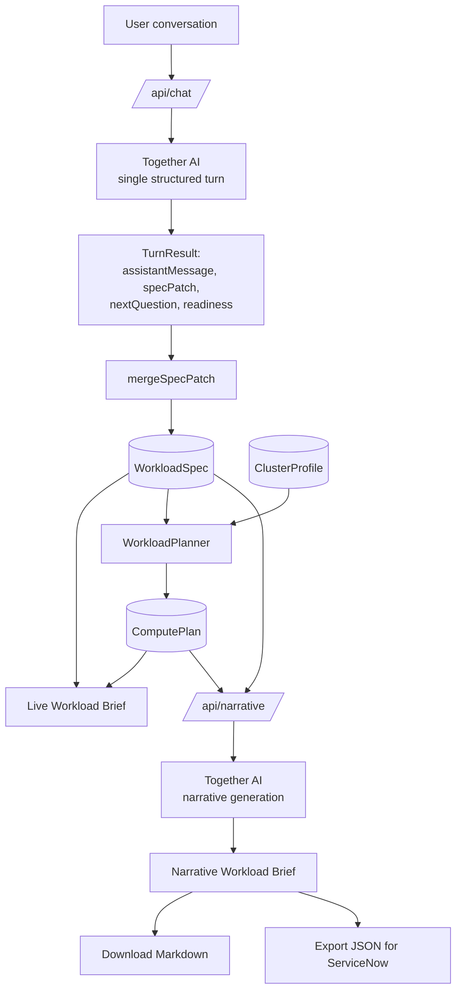

# ComputeBrief

> Describe what you want to build. We'll figure out what it takes.

ComputeBrief is a conversational intake tool for people who want to use a large, high-performance
GPU compute environment but may not know enough about ML infrastructure to specify their own
requirements. It behaves like an experienced ML requirements engineer: you describe what you're
trying to accomplish in plain language, and it progressively builds a structured, provenance-tagged
`WorkloadSpec`, derives a `ComputePlan`, and produces a narrative **Workload Brief** you can hand to
a technical reviewer — plus an optional machine-readable export for ServiceNow.

It is explicitly *not* a model-training intake form. It is comfortable concluding that no training
is needed at all — that inference over an existing model, RAG, or a much smaller experiment is the
right answer — and it says so.

## Product principles

- **Ask what people actually know.** Never "how many GPUs do you need?" Instead: "roughly how much
  data do you have?", "do you already have a model or training code?", "what would make this a
  success?" The technical requirements are inferred from those answers.
- **Facts vs. inference vs. unknown, always tagged.** Every meaningful field in the spec carries a
  `source` (`user_provided` | `ai_inferred` | `unknown`), and inferred fields carry a `confidence`
  and a short, plain-language `reason`. Nothing inferred is ever silently presented as a stated
  fact, and nothing is fabricated to fill a gap — unknowns stay unknown.
- **Ranges, not false precision.** The target environment is assumed to have significant modern
  NVIDIA Blackwell-class GPU capacity, but no exact cluster configuration is invented. Compute
  recommendations are expressed as ranges ("4–8 GPUs initially, 16–32 at scale"), and the system is
  willing to say a large allocation isn't justified yet — recommending a small benchmark first is a
  valid, desirable outcome.
- **Corrections overwrite, they don't blend.** "Actually it's 5TB, not 50TB" replaces the value and
  its provenance outright; nothing stale survives into the final brief.

## Architecture



- **Next.js App Router + TypeScript**, Tailwind CSS, shadcn/ui (base-nova preset, `@base-ui/react`).
- **Vercel AI SDK (`ai`) + `@ai-sdk/togetherai`** — the only place Together AI is called from is
  `lib/ai/provider.ts` and `lib/ai/conversation.ts`. Application code never talks to Together
  directly.
- **Zod schemas** (`lib/schema/`) are the contract everything else is built against: `WorkloadSpec`,
  `ComputePlan`, `TurnResult` (the model's per-turn structured response), and the canonical export
  shape.
- **`WorkloadPlanner`** (`lib/planner/workload-planner.ts`) is a deterministic, pure function —
  `(WorkloadSpec, ClusterProfile) → ComputePlan`. It assembles a coherent plan from whatever the
  model has already inferred, and falls back to a conservative "benchmark first" recommendation when
  signal is thin. It is not itself an AI call, which keeps compute-sizing reasoning out of the chat
  transcript and independently testable. Because it's pure and side-effect-free, it also runs
  **client-side** to power the live Workload Brief panel, and again server-side (from the same
  source) when the final brief is generated — same inputs, same output, by construction.
- **No database.** Conversation + spec state lives in a React context, persisted to
  `sessionStorage` so a refresh doesn't lose progress. "Start New Intake" clears it.

## Getting started

```bash
npm install
cp .env.example .env.local   # then fill in TOGETHER_API_KEY
npm run dev
```

Open [http://localhost:3000](http://localhost:3000).

### Environment variables

| Variable | Required | Default | Notes |
|---|---|---|---|
| `TOGETHER_API_KEY` | Yes | — | Server-only. Never sent to the client. |
| `TOGETHER_MODEL` | No | `zai-org/GLM-5.3-Flash` | See `config/model.ts`. Swapping models is a config change, not a code change. |

Both are read only inside `lib/ai/provider.ts` / the API routes — nothing under `app/` (client
components) or `components/` ever imports them.

## The `WorkloadSpec` and provenance model

`lib/schema/workload-spec.ts` is a deeply partial Zod schema — almost every leaf is optional, and
unknown information is represented explicitly rather than by omission. Most fields are wrapped in a
shared `Provenance<T>` shape (`lib/schema/provenance.ts`):

```ts
{
  value: T | null,
  source: "user_provided" | "ai_inferred" | "unknown",
  confidence?: "high" | "medium" | "low",   // only meaningful for ai_inferred
  reason?: string,                          // short, user-facing — never a reasoning trace
  assumptions?: string[],
}
```

The model returns a **patch** against this shape each turn (validated only loosely at the API
boundary, since the Together model used here doesn't support strict structured-output
enforcement — see "A note on latency and structured outputs" below). `lib/state/merge-patch.ts`
deep-merges that patch into the current spec: plain nested objects (like `requester` or `compute`)
merge key-by-key, but a provenance leaf or an array is always **replaced wholesale**, never merged
field-by-field — this is what makes corrections behave correctly (a new `ai_inferred` guess can't
accidentally inherit a stale `reason` from a previous `user_provided` value) and what stops one bad
turn from corrupting the whole tree (`app/api/chat/route.ts` falls back to keeping the prior spec
for that turn if a patch doesn't validate, rather than failing the whole request).

## `WorkloadPlanner` and `ComputePlan`

Given a `WorkloadSpec`, the planner derives a `trainingVsInference` classification
(`train_new_model` | `fine_tune_existing` | `inference_only` | `hybrid` | `undetermined`) from the
conversation's inferred `classification` array, checks whether there's enough signal (maturity past
"idea"/"exploration", and either a confirmed data size or `data_exists`) to size anything at all,
and either:

- produces an initial-experiment / likely-scaled-workload GPU range with `medium` confidence, or
- falls back to `benchmarkFirstRecommended: true` with `low` confidence and a recommended next
  action to run a small benchmark before committing to a larger allocation.

See `tests/planner/workload-planner.test.ts` and `tests/fixtures/workload-specs.ts` for the
scenarios this is built against (novice/satellite-imagery, experienced/scaling-an-existing-pipeline,
no-training-needed/RAG, early-idea, and a correction scenario).

`config/cluster-profile.ts` is the seam for a real cluster configuration later — for the MVP it's a
typed `ClusterProfile` with every concrete field left `null` except a documented assumption
("significant modern NVIDIA Blackwell-class GPU infrastructure is available"). Nothing in the
planner or UI assumes a hard-coded exact configuration.

## Narrative generation

"Generate Workload Brief" calls `/api/narrative`, which recomputes the `ComputePlan` from the
current spec server-side (same pure function as the live panel) and asks Together AI to synthesize
the full spec + plan into prose — not a field dump — following a fixed section order (see
`lib/ai/prompts/narrative.ts`): what the requester is trying to accomplish, current state, proposed
technical approach, data, compute recommendation, storage/networking, software, access, evaluation,
output/deployment, assumptions, open questions, blockers, recommended next steps.

## ServiceNow export

`lib/export/canonical-json.ts` produces a versioned, stable-field-name JSON payload
(`{ schema: "computebrief.workload", schemaVersion, ... }`, version centralized in
`config/export.ts`). `lib/export/servicenow.ts` currently re-exposes that payload unchanged, with
the future ServiceNow-specific field-mapping adapter documented as an explicit extension point in
that file — no live ServiceNow API integration exists or is required for this MVP. Unknown values
serialize as explicit `{ value: null, source: "unknown" }`, never a fabricated placeholder.

## Schema versioning

`COMPUTEBRIEF_SCHEMA` / `COMPUTEBRIEF_SCHEMA_VERSION` live in `config/export.ts` and nowhere else —
no `"1.0"` literals scattered through the codebase.

## Tests

```bash
npm test          # vitest run
npm run test:watch
npm run lint
npx tsc --noEmit
npm run build
```

Tests cover the schema (complete/partial/corrected specs, provenance, export round-trips), the
planner (the five scenarios above), the conversation-turn orchestration and both API routes against
**mocked** Together responses (no live network calls in the suite — deterministic and free to run in
CI). There are no automated tests for the React UI layer; that was a deliberate scope decision (see
`docs/superpowers/specs/2026-09-23-compute-brief-design.md`) verified instead by manual testing
against the real Together API during development.

## A note on latency and structured outputs

The configured model (`zai-org/GLM-5.3-Flash` on Together) doesn't support the AI SDK's strict
structured-outputs mode (`supportsStructuredOutputs: false` on the provider's language model), so
`generateObject`/`streamObject` fall back to a JSON-via-prompt strategy rather than a
schema-constrained decode. A full turn (including the structured `specPatch`) can still take on the
order of several seconds to a minute depending on conversation length, but the conversational turns
stream: `/api/chat` uses `streamConversationTurn` (`lib/ai/conversation.ts`), which reads Together's
`partialObjectStream` and forwards each new slice of `assistantMessage` text to the client as soon as
it's generated (via a small newline-delimited-JSON protocol — see `lib/ndjson.ts`), so the reply
appears progressively rather than after one long blocking wait. The structured `specPatch` (which
drives the live Workload Brief panel) still only becomes available once the full object is validated
at the end of the stream. `streamConversationTurn` retries once on a failure that occurs before any
text has reached the client (safe, since nothing user-visible needs to be undone); once any text has
streamed, a failure is surfaced as an in-band `{"type":"error"}` event instead, since the HTTP
response has already started. `app/api/chat/route.ts` separately falls back to keeping the prior spec
(while still returning the assistant's message) if the final patch doesn't validate against
`WorkloadSpecSchema`, so one malformed turn doesn't break the conversation. Narrative generation
(`/api/narrative`) is a one-time, less latency-sensitive action and remains non-streaming.

## Deployment

The GitHub repository is connected to a Vercel project via the standard GitHub integration:
`main` deploys to production, feature branches get preview deployments. Set `TOGETHER_API_KEY` (and
optionally `TOGETHER_MODEL`) as Vercel project environment variables — for local development,
`vercel env pull .env.local` after they're set.

## Known limitations of this MVP

- No persistence beyond `sessionStorage` — closing the tab loses the conversation (by design; see
  the design doc's non-goals).
- No accounts, auth, or approval workflow.
- No live ServiceNow API integration — the JSON export is the interchange format; a mapping adapter
  is a documented future extension point, not implemented.
- No automated UI tests (see "Tests" above).
- Per-turn latency (10–60s) is inherent to the configured model lacking structured-output support on
  Together's OpenAI-compatible endpoint, not to the app's own request handling.

## Roadmap (not implemented, architecture leaves room for it)

```
Conversational Intake → Validated WorkloadSpec → Compute Review → ServiceNow Request
  → Permission Provisioning → Environment Generation → GPU Allocation → Job Submission
  → Experiment Tracking
```

Kubernetes/scheduler integration, live ServiceNow API calls, real accounts/RBAC, a persistent
database, multi-model routing, and actual GPU reservation are all explicitly out of scope for this
MVP — see the design doc's "Explicit non-goals" section.
